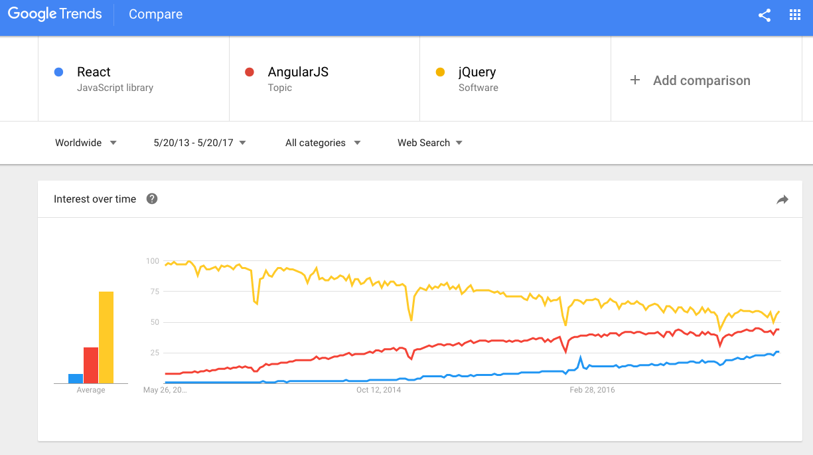

# Front-end Development with JavaScript

## Introduction to React

---

# React

## Create your own HTML dialect

---

# React

> a javascript library for building user interfaces

- Created by Facebook in 2011
- Open-source
- Component-oriented
- JavaScript-based
- Allows writing HTML inside JS (optional but recommended)
- Allows writing CSS in JS (advanced)

---

# React main features

- One-way data flow
- Virtual DOM
- JSX

---

# Who's using React?

## Short answer: everybody

---

# Who's using React?

**Airbnb**, ARTE, Atlassian, **BBC**, Clash of Clans, Codecademy, **Coursera**, Dailymotion, Disqus, Docker, Domai.nr, **Dropbox**, **eBay**, **Facebook**, **HP**, IMDb, Imgur, **Instagram**, Khan Academy, Lyft, **Microsoft**, National Hockey League, NBC, **Netflix**, National Football League, OkCupid, **Paypal**, Pinterest, **Reddit**, Salesforce, Skyscanner, **The New York Times**, Twitter Mobile, **Uber**, Udacity, Walmart, **WhatsApp**, Wired, Wix, WordPress.com, **Yahoo**, [and many more](<https://github.com/facebook/react/wiki/Sites-Using-React>)


---

# Popularity

<https://github.com/search?q=stars%3A%3E1&ref=searchresults&type=Repositories&utf8=%E2%9C%93>

- 4th most starred project of all time on github
- 69,000 stars
- 13,000 forks

---



# Google trends

## React vs Angular vs jQuery

<https://trends.google.com/trends/explore?date=2013-05-20%202017-05-20&q=%2Fm%2F012l1vxv,%2Fm%2F0j45p7w,%2Fm%2F0268gyp>

---


---

# React Native

## Learn once, write anywhere

---

# React Native

## Learn once, write anywhere

- React Native allows you to write native apps using the same technologies you use to build React web pages: JavaScript and JSX.
- It uses native UI widgets from each platform
- Has good performance
- Supports iOS and Android apps
- *NB: We won't be covering React Native in this course*

---

# node.js

JavaScript used to be a language that could only run in the browser, meaning it was only used for front-end web development, i.e. client-side code.

Ryan Dahl released node.js in 2009, which made it possible to run JavaScript outside the browser. This allowed people to start using JavaScript for back-end web development, running JavaScript on the server, instead of the browser (a.k.a. the client)

<https://nodejs.org/en/>

---

# One language to rule them all

With node.js, people no longer have to use one language for the back-end (e.g. PHP, Perl, Python, Ruby, Java or C#) and one language for the front-end.

Now people can use the same language for writing both sides of complex web apps, reducing cognitive complexity and barriers to entry to web development.

---

# next.js

Next.js is a server-side framework that runs on node.js and which makes it easy serve React pages.

One of its big selling points is that it supports Server-Side-Rendering, which greatly increase the speed of the First-Page-Render.

Another popular tool for getting started with React is Facebook's own create-react-app, but that only supports front-end React rendering.

---

# Frameworks vs Libraries

Libraries are something your code calls. They give you maximum freedom, but take a Do-It-Yourself approach. They are not prescriptive, you can use them however you want (even if it means shooting yourself in the foot)

Frameworks are something that calls your code. They maximize convenience, as long as you're willing to play by their rules. They are prescriptive: "my way or the highway".

---

# React and next.js

React is a library that you can call from any code. Although some JavaScript frameworks like Angular, Ember or Knockout somewhat compete for attention with React, you can actually use React from Angular.

Next.js is a framework built on top of React. It expects your code to follow certain conventions. As long as you do, it does a lot of work for you, so you end up writing (and maintaining) less code.

---

# next.js conventions

- JavaScript files corresponding to pages should be put inside the pages/ directory
- Pages should export a function that returns JSX
- Static files (e.g. images, icons) should be put under static/
- React components should be put inside components/

---

# Using React with next.js

---

# Install Chocolatey package manager for Windows

On Windows 10, [Open Command Prompt as Administrator](https://www.howtogeek.com/194041/how-to-open-the-command-prompt-as-administrator-in-windows-8.1/)

Run the following command:

```cmd
@"%SystemRoot%\System32\WindowsPowerShell\v1.0\powershell.exe" ^
-NoProfile -ExecutionPolicy Bypass -Command ^
"iex ((New-Object System.Net.WebClient).DownloadString('https://chocolatey.org/install.ps1'))" ^
&& SET "PATH=%PATH%;%ALLUSERSPROFILE%\chocolatey\bin"
```

---

# Upgrade Chocolatey

Close Command Prompt and re-open it again as Administrator

Upgrade Chocolatey

```cmd
choco upgrade chocolatey
```

---

# Install node.js

Run the following command:

```cmd
choco install nodejs
```

Close Command Prompt and re-open it again

Check if `npm` command is available

```cmd
npm
```

---

# Create your first node package

Create a new folder with the File Explorer, calling it e.g. `next2`

Hold down the Shift key and right-click on the new folder. The context menu will contain an entry, ‘Open command window here.”

Run the following command in the Command Prompt, and press return in reply to each question:

```cmd
npm init
```

---

# Install next.js

To run next.js, you need to install three packages: next, react and react-dom. To add these as dependencies to your package.json file, add the `--save` option:

```cmd
npm install next react react-dom --save
```

This could take several minutes.

---

# Modify scripts section of your package

Open the `next2` folder in VSCode (go to File menu and choose Open Folder, navigate to next2 and select it)

Click on package.json

Replace the scripts section with this snippet:

```json
"scripts": {
    "dev": "next",
    "build": "next build",
    "start": "next start"
},
```

---

# Run next.js

Only one thing missing before we can run next.js: inside the "next2" folder, create an empty "pages" folder.

You can now run next.js by running the `dev` script that you just added to your package.json:

```cmd
npm run dev
```

Node is now running on your machine and serving your next.js web pages on <http://localhost:3000>

---

# Create your first next.js page with React

Your `pages` folder is empty, so you will get a 404 error when navigating to <http://localhost:3000>.

Create an empty file inside `next2\pages` and call it index.js. Put the following code inside it:

```jsx
let hello = function() {
    return <div>Welcome to next.js!</div>
}

export default hello
```

---

# Viewing your first page

If your browser is still open, the page should automatically refresh. Try modifying the text inside the div, then save your file and see the browser automatically reload the new page. Otherwise navigate again to <http://localhost:3000>.

The page that we created is using two new things: JSX and ES6 exports.

For more info on ES6 exports, go to the [MDN docs](https://developer.mozilla.org/en/docs/web/javascript/reference/statements/export)

---

# Nota Bene: JSX is not HTML

There's one important difference between JSX and HTML. Since "class" is a reserved word in JavaScript, and JSX is embedded in JS, we cannot use "class" as an element property in our JSX code. Thus in JSX we have to use "className" instead of "class". This is JSX:

```HTML
<p className="yellow">Welcome to your new clean React site</p>
```

while this is HTML (don't put this in your React!):

```HTML
<p class="yellow">Welcome to your new clean React site</p>
```

---

# JSX to JS

For those of you more comfortable with JavaScript, you don't have to use JSX. This JSX:

```HTML
<Footer text="Footer™ ©2017 Tiago Henriques" 
  blabla="this property will be ignored" />
```

is roughly equivalent to this JavaScript:

```JS
let properties = {
  text: "Footer™ ©2017 Tiago Henriques",
  blabla: "this property will be ignored",
}
Footer(properties)
```

---

# Install React Developer Tools

Follow [these instructions](https://react-bootstrap.github.io/) to install Facebook's React Developer Tools. Once installed, you will have a new menu in the [Chrome Developer Tools](https://developers.google.com/web/tools/chrome-devtools/) that lets you view the React-DOM, i.e. the tree of React components that corresponds to your page.